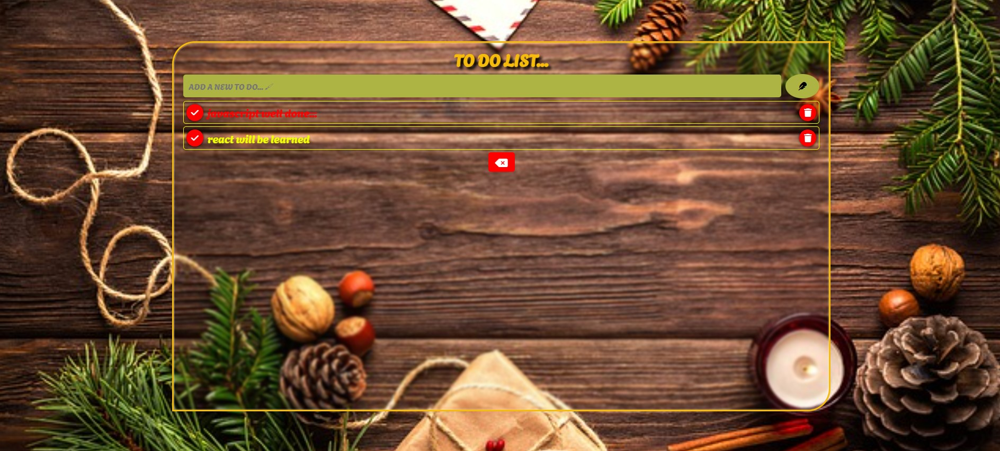

# To-Do List Application

This is a simple web application that allows users to create and manage a to-do list. Users can enter tasks they want to add, mark completed tasks, and remove tasks from the list.

## How to Use

1. **Adding a Task**
   - Enter a text in the "ADD A NEW TO DO... 🖌" field and then click the add button or press Enter.

2. **Completing a Task**
   - You can complete a task by clicking on the checkmark icon next to the task. The text of completed tasks turns red.

3. **Removing a Task**
   - To remove a task, click on the trash can icon next to the task.

4. **Resetting All Tasks**
   - You can reset all completed tasks by clicking the "RESET" button at the top.

## Technologies Used

- HTML
- CSS
- JavaScript

## External Libraries

- [Font Awesome](https://fontawesome.com/): Used for visual icons.

## Installation

1. Clone this repository or download it as a ZIP file.

2. Open the downloaded files in a web server or in your browser.

## Important Notes

- Tasks are not saved across sessions. They will be cleared when you refresh the page or close the browser.

## Live Demo

Check out the live demo [here](https://to-do-list-wgkl.vercel.app/).
